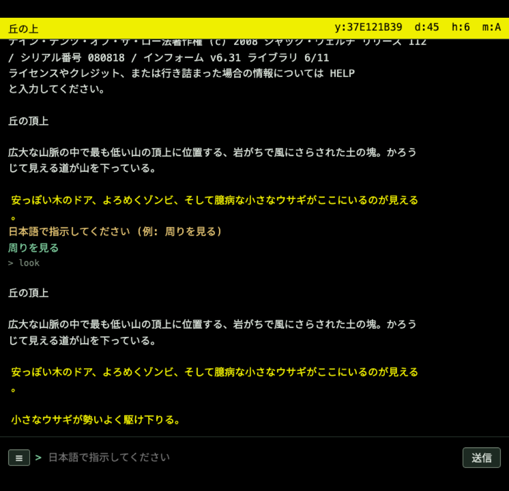

# yominterp

**英語のインタラクティブフィクション (IF) を、日本語で遊ぶ。**

yominterp (ヨミンタープ) は、英語で書かれた Z-machine / Glulx のインタラクティブフィクション (ZORK のようなテキストアドベンチャー) を、AI 翻訳をはさんで**日本語のまま遊べる**ようにするプレイヤーです。

- あなたは**日本語で指示**を打ち、画面は**日本語で**返ってきます。
- ゲーム本体もインタプリタも改造しません。手持ちの英語ゲームファイル (`.z3 / .z5 / .z8 / .zblorb` など) をそのまま読み込めます。
- 翻訳は、あなたが用意した LLM (手元で動くローカル LLM や、OpenAI 互換 API) が行います。

> 名前の由来: yomin = Enchanter シリーズの「心を読む」呪文 + interp(reter)。



> スクリーンショットのゲームは *Nine-tenths of the Law* by Jack Welch (ライセンス **[CC BY-NC-SA 3.0](https://creativecommons.org/licenses/by-nc-sa/3.0/)** / <https://github.com/dhakajack/ninetenths>)。
> この画像は yominterp による日本語訳を含む原作の**二次的著作物**であり、**CC BY-NC-SA 3.0** で提供されます (yominterp 本体コードの MIT ライセンスとは別の素材です)。SA に従い派生物も同一ライセンス、NC につき商用利用時はこの画像の扱いにご注意ください。

## 特徴

- 🌐 **英語 IF を日本語で** — 入口 (日本語 → ゲームが受理する英コマンド) と出口 (英語 → 日本語) の二段翻訳。ゲームもインタプリタも無改造。
- 🎮 **手持ちのゲームで (BYO game)** — `.z3 / .z5 / .z8 / .zblorb` をそのまま。ゲームは同梱しません。
- 🤖 **あなたの LLM で (BYO LLM)** — 手元のローカル LLM (LM Studio / Ollama / llama.cpp) でも、OpenAI 互換 API でも。API 料金なし・プライバシーを保てます。
- 🖥️ **クラシック端末** — 80×24 桁の古典端末そのままの画面。等幅フォント同梱で環境を問わず同じ表示。
- 📄 **原文トグル** — 日本語訳と並べて英語の原文も確認できます。
- 🩹 **自己修正** — パーサに弾かれても、裏で言い直して再挑戦。弱いローカルモデルでも実用に。
- 🌍 **多言語 (実験的)** — 日本語のほか スペイン語・フランス語・ドイツ語・ポルトガル語(ブラジル) でも遊べます。
- 🔒 **プライバシー重視** — API キーは既定でメモリのみ、接続先はあなたが設定した endpoint だけ。

## 遊び方

1. **ゲームを開く** — メニューの「開く」から、手持ちの英語 IF のゲームファイルを選びます。
   ゲームは同梱していません。[IF Archive](https://ifarchive.org/) などで公開されているフリー作品などをご用意ください。
2. **LLM を設定する** — メニューの「設定」で、翻訳に使う LLM の接続先を入力します。
   - 手軽なのは**ローカル LLM** ([LM Studio](https://lmstudio.ai/) など)。例: `http://127.0.0.1:1234/v1`
   - OpenAI 互換の API でも動きます。
   - 「接続テスト」で疎通を確認できます。
3. **日本語で遊ぶ** — 入力欄に「周りを見る」「ランプを取って北へ行く」のように日本語で指示します。
   会話シーンの選択肢はボタンで選べます。うまく伝わらなかったときは、裏で自動的に言い直して再挑戦します。

### 表示

- 画面は **80×24 桁のクラシック端末**です (1 画面ずつ [More]/「キーを押して続行」で送る、古典 IF そのままの体験)。
- **原文表示** — メニューの「原文」で、日本語訳と並べて英語の原文も表示できます。

### 言語を変える (実験的)

既定は日本語ですが、「設定」の **プレイ言語** から **日本語・スペイン語・フランス語・ドイツ語・ポルトガル語(ブラジル)** を選べます。選ぶと、入力もゲーム表示も画面の文言もその言語になります (変更は次に開くゲームから反映)。

> ⚠ 多言語は**実験的な機能**です。翻訳の品質は使う LLM のモデルに大きく依存します (日本語以外は、多言語に強いモデルの利用を推奨)。中国語・韓国語などは現状の対象外です。

### セーブ

ゲーム内の `save` / `restore` (メニューの「セーブ」「ロード」) は、お使いのブラウザ／アプリ内にゲームごとに保存されます。

## 入手と起動

### インストール (デスクトップ版・推奨)

[**Releases**](https://github.com/h-o-soft/yominterp/releases) から、お使いの OS のファイルをダウンロードしてください。

- **macOS (Apple Silicon)**: `.dmg` を開いてアプリを Applications へ
- **Windows**: `.msi` または `-setup.exe` を実行

> ⚠ **配布物は署名されていません**。初回起動時に OS の警告が出ます:
> - **macOS**: 「開発元を確認できない」と出たら、アプリを**右クリック → 開く**。
>   「壊れている」と出る場合はターミナルで `xattr -dr com.apple.quarantine /Applications/yominterp.app` を実行してから開いてください。
> - **Windows**: SmartScreen の画面で**「詳細情報」→「実行」**を選んでください。

デスクトップ版は**プロキシなどの設定なしで** `http://127.0.0.1` のローカル LLM に直接つながります。

### ソースから起動 (開発者向け)

```bash
npm install
npm run tauri dev      # Rust のツールチェーンが必要です
```

### ブラウザ版 (best-effort)

ブラウザ版は **best-effort** で維持しています (動作するよう配慮はしますが、ブラウザ固有の問題への積極対応やブラウザ専用の最適化は行いません。フル対応が必要な方は fork をどうぞ)。

```bash
npm install
npm run build:web
npx vite preview       # 表示された URL をブラウザで開く
```

ブラウザ版でローカル LLM につなぐ場合は、LLM サーバー側で CORS の許可が必要です (LM Studio なら Settings → Developer → Enable CORS)。許可できない環境では同梱の中継ツールを使えます (→ [開発者向け](#開発者向け))。

## 翻訳に使う LLM について

翻訳に使う LLM は**あなたが用意**します。

- **ローカル LLM がおすすめ**: LM Studio / Ollama / llama.cpp など。手元で動くので API 料金がかからず、プライバシーも保てます。日本語が得意な軽量モデルでも実用になります。
- **OpenAI 互換 API** でも動作します。ただし高額なクラウドのキーをブラウザで使うのはおすすめしません (使い捨てキーかローカル LLM を)。
- API キーは既定で**メモリ上にだけ**保持され、リロードで消えます。保存するのは明示的に選んだときだけです。接続先はあなたが設定した endpoint のみで、第三者に送られることはありません。

## ライセンス

MIT License。個人の趣味プロジェクトです。
同梱している仮想マシン (Bocfel / Glulxe / AsyncGlk / RemGlk-rs) はすべて MIT ライセンスです。
ゲームファイルは同梱しておらず、著作権は各作者に帰属します。お手持ちの作品をご用意ください。

フォントとして [PlemolJP](https://github.com/yuru7/PlemolJP) HS (Hidden Space 版, Copyright 2021 Yuko OTAWARA) を同梱しています。
PlemolJP は **[SIL Open Font License 1.1](public/fonts/OFL-PlemolJP.txt)** の別ライセンス素材です (本体コードの MIT とは別)。
フォントファイルは無改変のまま WOFF2 形式に再パッケージして同梱しています。

例外として、スクリーンショット `docs/screenshot-ja.png` は *Nine-tenths of the Law* by Jack Welch ([CC BY-NC-SA 3.0](https://creativecommons.org/licenses/by-nc-sa/3.0/)) の二次的著作物のため、**この画像のみ CC BY-NC-SA 3.0** で提供されます (本体コードの MIT とは別)。

---

## 開発者向け

<details>
<summary>仕組み・ビルド・テスト・中継ツール</summary>

### 仕組み

入口 (日本語の意図 → ゲームのパーサが受理する英コマンドへ変換 ＋ 自己修正ループ) と、出口 (英語出力 → 日本語、固有名詞は用語集で表記統一) の 2 段の翻訳をはさみます。ゲーム本体もインタプリタも無改造で、ストーリーファイルはデータとして読むだけです。

VM は [emglken](https://github.com/curiousdannii/emglken) (Bocfel ほか、WASM) をアプリ内に埋め込みます。翻訳層 (`src/core/`) は環境非依存で、ブラウザ版・デスクトップ版で共有します。

### ビルドとテスト

```bash
npm install
npm run tauri dev     # デスクトップ版 (主軸。Tauri、要 Rust)
npm test              # ユニットテスト (vitest)
npm run build:web     # ブラウザ版 (best-effort) を dist/ に生成
npm run e2e           # ブラウザ実描画テスト (Playwright、要 build:web)
```

### ローカル LLM への中継ツール (CORS 回避)

ブラウザ版で LLM サーバーの CORS を有効化できない場合の中継 CLI:

```bash
npm run proxy -- --target http://127.0.0.1:1234
# 表示された Base URL (トークン入り) をアプリの「設定」に貼り付ける
```

127.0.0.1 のみに bind し、起動ごとのランダムトークンを必須にし、転送先は起動時に固定されます (踏み台化防止)。API キーは保存・注入せず素通しします。

### CLI 版 (ターミナルで遊ぶ)

```bash
brew install frotz                  # dfrotz 同梱
cp config.example.json config.json
npm run play                        # ターミナルで日本語対話プレイ
```

### ライセンスの注意

同梱する VM はすべて MIT です。GPL のエンジン (TADS / SCARE など) はバンドルしません (CI で `dist/` を検査しています)。

</details>
